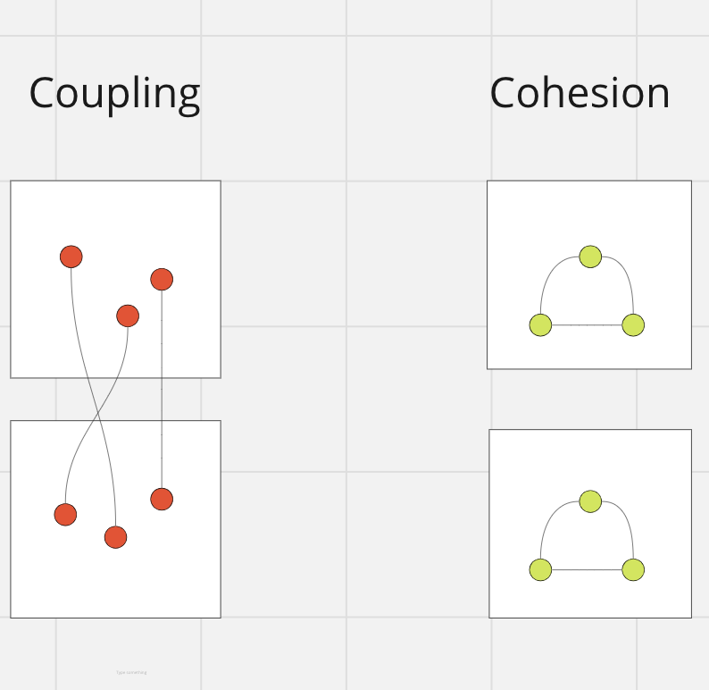
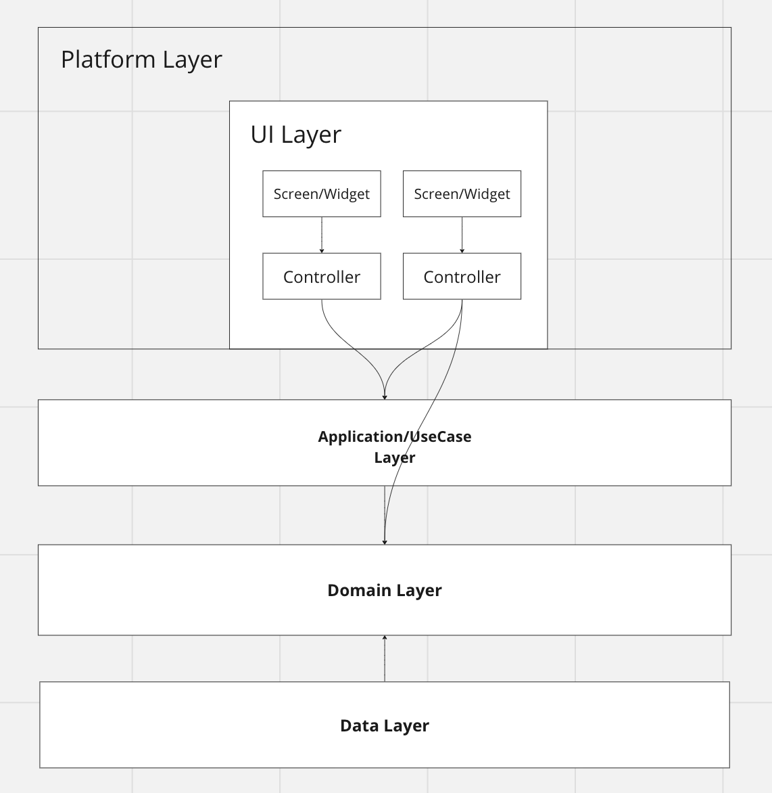

## **Create a New Model with freezed and json_serializable**

Create a new Dart file for your model, for example, **`my_model.dart`**:

```dart
import 'package:freezed_annotation/freezed_annotation.dart';

// Optional: Use json_annotation if needed
import 'package:json_annotation/json_annotation.dart';

part 'my_model.freezed.dart';
// Optional: Part for json_annotation
part 'my_model.g.dart';

@freezed
class MyModel with _$MyModel {
  // Optional: Part for json_annotation
  @JsonSerializable(explicitToJson: true)
  factory MyModel({
    required String name,
    required int age,
  }) = _MyModel;

  // Optional: Factory for json_annotation
  factory MyModel.fromJson(Map<String, dynamic> json) =>
      _$MyModelFromJson(json);
}
```

Run the following command to generate necessary files:

```dart
dart run build_runner build
```

## ****Adding New Images with flutter_gen****

Assuming you have your image files in **`assets/png/`** or  **`assets/svg/`**  directory:

Open your terminal and run the following command:

```dart
flutter pub run flutter_gen
```

This will generate the necessary files directly into the specified output directory (**`lib/generated/`**).

In your Dart files, import the generated code to use it. For example, in your widget file:

```dart
// Use generated code from flutter_gen
import 'package:heyo/generated/assets.gen.dart';

class MyWidget extends StatelessWidget {
  @override
  Widget build(BuildContext context) {
    return Image.asset(
      Assets.images.myImage,
    );
  }
}
```

## ****Localization****

**Navigate to the Localization Directory** (**`assets/locales/`**), update the json and add or modify translations as needed.

**Run `flutter_gen`:**

```dart
flutter pub run flutter_gen
```

Import the generated code in your Dart files for it usage:

```dart
import 'package:heyo/generated/assets.gen.dart';

class MyWidget extends StatelessWidget {
  @override
  Widget build(BuildContext context) {
    return Text(
      LocaleKeys.registration_WelcomePage_title.tr,
    ),
  }
}

```

# Architecture and Boundaries:

An architecture is clean when the system has reasonable separation concerns.
We want to make the changes fast and with minimum effects and minimize the resources needed to maintain our project.

Separation concern is about defining the boundaries and, from another perspective, is about coupling and cohesion.



Coupling is the dependency among units in different modules.\
It reflects how part of one module influences parts of other modules.\
Cohesion is the relationship between the units within a module and indicates how grouped the units are.\
In highly coupled modules, by changing a module, we see other changes in other modules or experience unexpected things breaking because of a change that appears to be entirely unrelated!\
So, by these, our goal is minimum coupling and maximum cohesion, grouping as much related code as possible to maintain and scale the project efficiently.

# Boundaries and Dependencies:



First, I'm going to explain about arrows, cause arrow matters!!\
As you see the `Widget` arrows `Controller,` it means the `Widget` is a client of `Controller` and uses it and takes advantage of it by injecting `Controller` to itself and considering the Controller as a Dependency.
Furthermore, the `Controller` knows nothing about the `widget`.
`knows nothing` means independent!\

So when you see `A` arrows `B,` Keep this in your mind:\
`A` is a client of `B` and depends on `B`; `A` delegates to the `B` to resolve its requirements; `B` doesn't know anything about `A.`

Next, I will explain the Layer and Its dependencies to ensure we put everything in the right place!

# Platform Layer:
## UI Layer:
### Widget/Screen:

`Widgets/Screen` is in charge of the presentation of data and receiving UI events.\
Should it be visible/enabled or not? Which data will be shown? How can the data be provided? Where should I navigate when I press the Button? None of them is the `Widget` Responsibility because the answer to these questions is behind logic.
All of them are the Controller's responsibility; the Controller is responsible for making these decisions.\
Widgets/Screens are passive; they don't make any decisions.\
They are showing and emitting UI events on a platform-specific.\
So, here is the question: How are they working together?\
`Widget,` a client of the `Controller,` subscribes and listens to the  `Controller` states/events and reacts to them.\
Also, `Widget` sends the UI events like clicks to the Controller, and `Controller` is a subscriber to the UI Events.

### Controller:
Here, we talk more about the `controller` and its responsibilities.\
`Controller` shapes the page(Widgets) by holding the states for a page or a widget, and `Widget` reacts to these states.\
So what's the state? What does it mean in this concept?\
Every page has its data and status; the `Widget` shows them, and the `Controller` provides them for the `Widget.`\
Should `Widget` show a name?\
`Controller` saves the name as a state of the page, and `Widget` listens to this state and fills itself with this data.\
Should `Widget` be invisible?\
`Controller` decides about it based on the current state of the page.\
If you go with this logic, you see all the behavior on a page stored in the Controller.
Magic comes!

So, by writing unit tests for the Controller, you will test all the functionality and expected things and ensure the page is acting correctly.

So how does the Controller work and fill the states?\
The Controller will directly interact with the Domain Layer and the Application Layer to fetch the required data.\
Also, In case of passing arguments from one page to another, we pass just initial data for the page, or we pass the UI model that we associated for the second page. Our UI model should be independent!

Note: Read more about these: Reactive pattern, Observer pattern, and Unidirectional data flow.


Next, we will discuss the Domain, Application, and Data layers.\
In these layers, you see the power of OOP.\
I will end this section with the conclusion of the OOP chapter in the Clean Architecture book.

``What is OO? There are many opinions and many answers to this question.
To the software architect, however, the answer is clear: OO is the ability, through the use of polymorphism, to gain absolute control over every source code dependency in the system. It allows the architect to create a plugin architecture, in which modules that contain high-level policies are independent of modules that contain low-level details. The low-level details are relegated to plugin modules that can be deployed and developed independently from the modules that contain high-level policies.``
